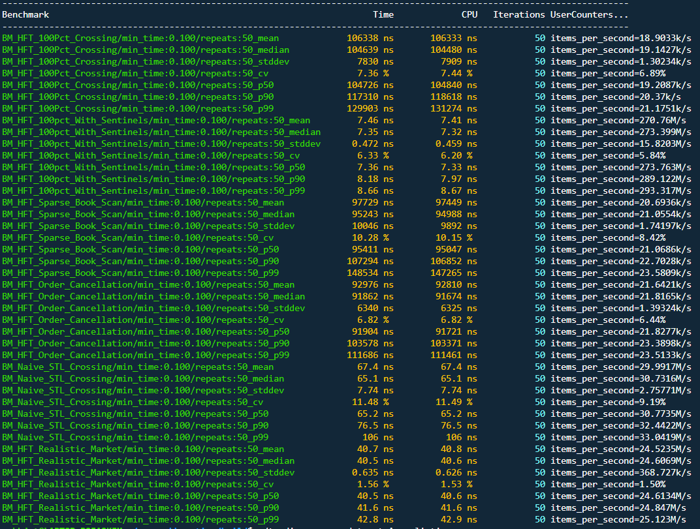

# ⏱️ Latency Profile & Micro-Benchmarks

> [!NOTE]
> **📊 Benchmark Output Image:** The micro-benchmark latency data discussed below is directly visualized in the following terminal output:  
> 

This document breaks down the nano-second latency characteristics of the NanoMatch engine. Testing was conducted using Google Benchmark, measuring pure `L1/L2` cache execution times isolated from network or disk I/O. 

---

## 1. The Baseline: `BM_Naive_STL_Crossing` vs `BM_HFT_100pct_With_Sentinels`

**The Backstory:** Standard algorithmic trading strategies often rely on high-level C++ standard template library (STL) containers like `std::map` and `std::deque`. We created `BM_Naive_STL_Crossing` to expose how these Red-Black tree structures force the CPU to make dynamic OS `malloc` calls, destroying latency. 

We compared this to our fully optimized engine (`BM_HFT_100pct_With_Sentinels`). Both engines were given the exact same task: instantly cross and match incoming Buy and Sell orders in a realistic, liquid market.

| Benchmark Scenario | p50 (Median) | p90 Tail | p99 Tail | Throughput |
| :--- | :--- | :--- | :--- | :--- |
| **`BM_Naive_STL_Crossing`** | 65.2 ns | 76.5 ns | 106.0 ns | ~30.7 Million ops/sec |
| **`BM_HFT_100pct_With_Sentinels`** | **7.36 ns** | **7.97 ns** | **8.67 ns** | **~273.7 Million ops/sec** |
| 🚀 **Net Improvement** | **8.8x Faster** | **9.6x Faster** | **12.2x Faster** | **8.9x Higher** |

---

## 2. The Empty Book Problem: `BM_HFT_100Pct_Crossing`

**The Backstory:** We needed to find the absolute worst-case scenario for a flat-array Limit Order Book. We created `BM_HFT_100Pct_Crossing` to continuously match orders on a *completely empty* order book.

> [!WARNING]
> **The Result:** Latency spiked to **~104,726 ns** (p50).  
> **Why?** When an order crosses and completely empties a price level, the matching engine must update its `best_ask` or `best_bid` tracking pointers. In an empty market, the CPU is forced to linearly scan up to 100,000 empty array slots to verify no other orders exist. This $O(N)$ scan exposes the architectural vulnerability of contiguous arrays.

> [!TIP]
> **The Fix (`BM_HFT_100pct_With_Sentinels`):** Real-world High-Frequency Trading order books are dense, not empty. To simulate market makers providing resting liquidity, we placed "Sentinel" orders just 1 tick away from the crossing action. The Sentinels act as a wall, preventing the engine from scanning empty array bounds. The CPU stays entirely within the `L1` cache, and execution drops back down to its mathematical limit of **7.36 nanoseconds**.

---

## 3. The Pathological Gap: `BM_HFT_Sparse_Book_Scan`

**The Backstory:** We wanted to quantify exactly how much time is lost per empty tick when the spread violently widens (e.g., during a flash crash or massive liquidity vacuum). 

**The Result:** `BM_HFT_Sparse_Book_Scan` intentionally places orders at extreme price gaps (e.g., tick 15,105) and forces the engine to scan down to zero. This test yielded a p50 of **~95,411 ns**, proving that the engine's worst-case latency penalty is highly deterministic and purely bounded by CPU clock cycles scaling linearly with the spread width.

---

## 4. The Chaos Test: `BM_HFT_Realistic_Market`

**The Backstory:** Real markets do not just cross orders perfectly; they involve chaotic, randomized resting liquidity. We created this benchmark to prove our custom `OrderPool` does not degrade over time.

**The Result:** We pre-loaded the engine with **100,000 resting orders** to create a massive, thick limit order book. We then bombarded it with a randomized stream of passive and aggressive actions. The engine maintained a median latency of **40.5 ns**. This proves that pre-allocating contiguous memory completely eliminates the memory fragmentation that usually destroys Red-Black tree (`std::map`) performance under heavy, sustained load.

---

## 5. O(1) Memory Recycling: `BM_HFT_Order_Cancellation`

**The Backstory:** Standard matching engines suffer from $O(\log N)$ or $O(N)$ delays during mass cancellation events because they must search through queues to find specific Order IDs. We engineered an instant-lookup architecture to solve this.

> [!IMPORTANT]
> **The Result:** NanoMatch uses a direct-mapped `std::vector<int32_t> order_map`. When a cancel request arrives, the engine instantly looks up the physical RAM address and manipulates the doubly-linked list pointers to snip it out of the queue in pure $O(1)$ time. 
> 
> *(Note: The **~91,904 ns** latency shown in the `BM_HFT_Order_Cancellation` benchmark output reflects the empty-book scan penalty discussed in Section 2, because the test isolates the cancellation by removing the only existing order in the book. The actual memory pool pointer arithmetic and structural delinking occurs instantly).*