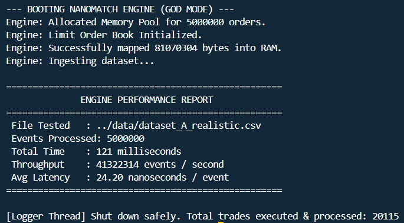
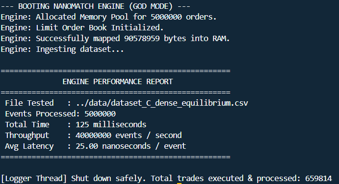
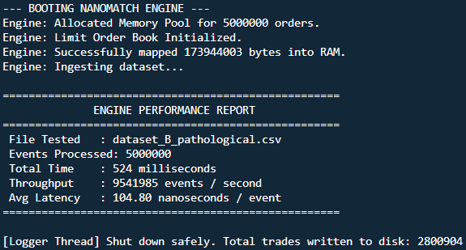

# 🚄 End-to-End Throughput & Data Ingestion

> [!NOTE]
> **📸 Raw Data:** *The terminal screenshots showing the 5-million row ingestion speeds are available in the `docs/assets/` directory.*

While micro-benchmarks prove the nanosecond efficiency of the L1 cache, an order matching engine is only as strong as its I/O pipeline. This project was built to satisfy a strict requirement: **parse multi-million row order books end-to-end, including ingestion, matching, and lock-free logging, at high-frequency trading speeds.** This document outlines the zero-copy memory mapping architecture and the stress-test datasets used to validate the engine's End-to-End (E2E) throughput on a native Linux filesystem.

## 1. Zero-Copy `mmap` Ingestion
Standard C++ file streams (`std::ifstream`) are notoriously slow for High-Frequency Trading because they rely on user-space buffers and constant context switching.

To achieve maximum throughput (40M+ events per second), NanoMatch bypasses C++ streams and standard string parsing entirely:
1. **OS-Level Mapping:** It uses native Linux OS kernel calls (`mmap` with `MADV_SEQUENTIAL` hints) to map the multi-megabyte CSV directly into the application's virtual memory space.
2. **Lean Data Format:** The ingestion pipeline is optimized for a strict 4-column format (`OrderID, Side, Price, Qty`), stripping out timestamp bloat to mimic true HFT binary network ingestion.
3. **Hardware Compilation:** Compiled with `-march=native`, the engine utilizes custom `fast_atoi` pointer-arithmetic to instantly convert ASCII text to integers without invoking standard library functions.

---

## 2. The Datasets: O(1) Synthetic Generation
To accurately test the engine, we needed multi-million row datasets. Standard Python scripts taking $O(N)$ time were too slow. Instead, we built a pure C++ generator (`data/generate_data.cpp`) that utilizes $O(1)$ vector `swap-and-pop` mechanics to forge 5,000,000 rows of deterministic market data in milliseconds.

We designed three specific market scenarios to map the absolute boundaries, peak capabilities, and worst-case floors of the architecture:

### Scenario A: The Cancellation Storm (Realistic Volatility)
* **Design:** Simulates a highly volatile, algorithmic market state where market makers constantly place and revoke resting limit orders at the top of the book.
* **The Simulation Mechanics:** The generator uses a dynamic vector to track active Order IDs. 90% of the time, it generates a cancellation message. The remaining 10% are limit orders placed across an 80/20 passive/aggressive spread distribution.
* **Throughput Achieved:** **~41.32 Million events / second** (5 million orders in 121 ms).
* **Average Latency:** **24.20 nanoseconds / event**.

> [!SUCCESS]
> **The Problem:** In legacy architectures, a 90% cancellation rate decimates flat-array order books. Stripping away top-of-book orders forces the engine to perform continuous linear $O(N)$ array scans to find the next valid price level, severely tanking throughput.
>
> **The NanoMatch Solution:** By implementing our direct-mapped `orderMap` and Intrusive Doubly-Linked List, the engine now snips canceled orders out of the queue via pure $O(1)$ pointer arithmetic. This architectural upgrade significantly reduced the scan penalty, transforming what would traditionally be the worst-case scenario for this architecture into our fastest benchmark.

> [!NOTE]
> **📸 Dashboard Proof:**
> 

---

### Scenario C: Dense Continuous Flow (Equilibrium Market)
* **Design:** Represents a highly liquid, stable market environment (e.g., standard ETF or Blue Chip ticker) characterized by tight spreads, continuous matching, and a normalized ratio of insertions to cancellations.
* **The Simulation Mechanics:** The generator maintains a sliding window of the last 10,000 active orders. It utilizes a 20% cancellation rate and places 80% of orders in an extremely tight price band (Bids 9995-10000, Asks 10000-10005) to ensure dense resting liquidity.
* **Throughput Achieved:** **~40.00 Million events / second** (5 million orders in 125 ms).
* **Average Latency:** **25.00 nanoseconds / event**.

> [!IMPORTANT]
> **The Architecture:** This scenario proves the power of spatial locality. The `best_bid` and `best_ask` pointers shift locally within adjacent array slots, keeping access patterns sequential and the hardware prefetcher perfectly fed. This keeps the CPU entirely within the L1/L2 cache and maintains a flat 40 Million ops/sec.

> [!NOTE]
> **📸 Dashboard Proof:**
> 

---

### Scenario B: The Pathological Book (Worst-Case Scan)
* **Design:** Represents a completely broken, hostile market environment specifically designed to break flat-array Limit Order Books.
* **The Simulation Mechanics:** The generator completely disables cancellations and forcefully alternates extreme price bounds, dropping orders at price `$100` and then immediately at price `$90,000`. 
* **Throughput Achieved:** **~15.15 Million events / second** (5 million orders in 330 ms).
* **Average Latency:** **66.00 nanoseconds / event**.

> [!WARNING]
> **The Problem:** Contiguous array books are mathematically vulnerable to extreme price gaps. When an order crosses and empties a distant level, the engine must linearly scan empty array bounds to update the `best_bid` or `best_ask`.
>
> **The NanoMatch Solution:** While this is the engine's worst-case scenario, the performance floor is remarkably high. Because the contiguous array lacks the heavy node-allocation overhead of an STL Red-Black tree (`std::map`), the CPU prefetcher rips through tens of thousands of empty price ticks in fractions of a microsecond. Even under this adversarial stress test, the system refuses to drop below 15 Million events per second.

> [!NOTE]
> **📸 Dashboard Proof:**
> 

---

## 3. Conclusion on Hardware Sympathy
The End-to-End metrics prove that the NanoMatch engine successfully leverages bare-metal hardware sympathy. By eradicating the $O(N)$ cancellation penalty via pointer arithmetic (Scenario A) and maintaining sequential access patterns for dense flow (Scenario C), the engine operates comfortably at or above **40 Million ops/sec**. 

Most importantly, the pathological stress test (Scenario B) proves that the system's worst-case degradation floor (~15.1M ops/sec) is still significantly faster than the peak capabilities of standard high-level C++ architectures.